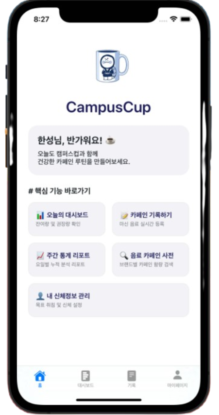
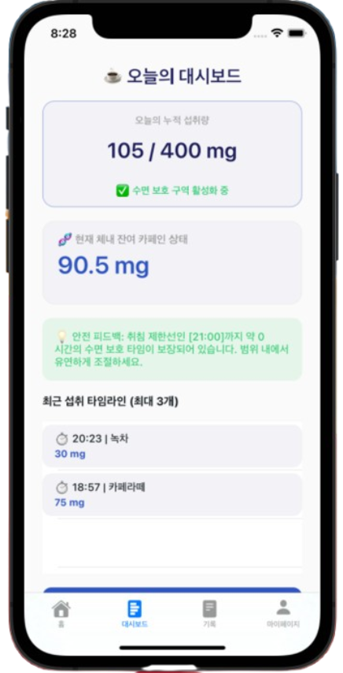
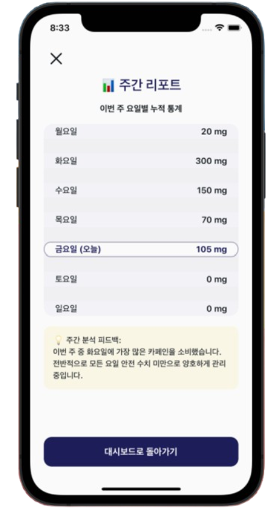
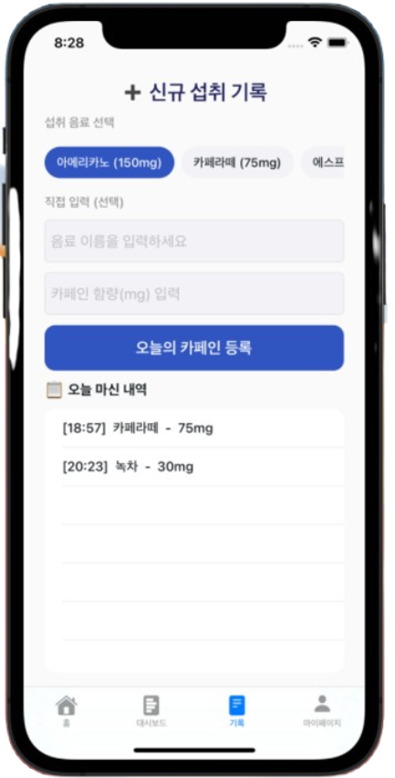
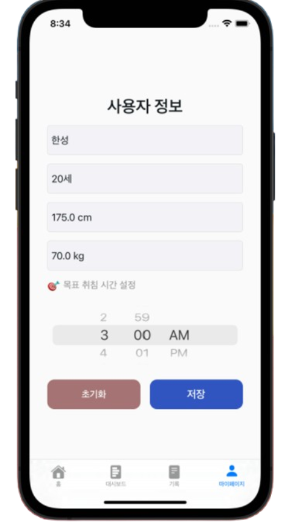
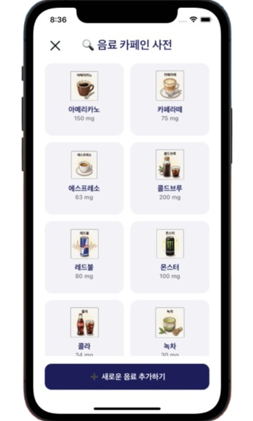

# CampusCup ☕

대학생의 건강한 카페인 섭취 습관 형성을 위한 iOS 애플리케이션

---

## 프로젝트 정보

| 항목 | 내용 |
|------|------|
| 과목명 | IOS프로그래밍 |
| 프로젝트명 | CampusCup |
| 소속 | 한성대학교 컴퓨터공학부 모바일소프트웨어트랙 |
| 학번 | 2071248 |
| 이름 | 이시형 |

---

# 1. 프로젝트 수행 목적

## 1.1 프로젝트 정의

CampusCup은 사용자의 카페인 섭취량을 기록하고 분석하여 건강한 카페인 소비 습관을 형성할 수 있도록 지원하는 iOS 애플리케이션이다.

사용자는 음료 섭취 내역을 기록하고, 체내 잔여 카페인량과 권장 섭취량을 확인할 수 있으며, 주간 리포트를 통해 자신의 섭취 패턴을 분석할 수 있다.

---

## 1.2 프로젝트 배경

대학생들은 과제, 시험, 팀 프로젝트 등으로 인해 커피와 에너지 음료를 자주 섭취한다.

그러나 카페인 과다 섭취는 수면 장애, 집중력 저하, 피로 누적 등의 문제를 유발할 수 있으며, 자신의 섭취량을 정확하게 파악하기 어려운 경우가 많다.

이에 따라 사용자가 카페인 섭취량을 손쉽게 기록하고 건강하게 관리할 수 있는 모바일 애플리케이션을 개발하고자 하였다.

---

## 1.3 프로젝트 목표

- 카페인 섭취 기록 기능 제공
- 일일 권장 섭취량 확인 기능 제공
- 체내 잔여 카페인량 분석 기능 제공
- 취침 시간 기반 경고 기능 제공
- 주간 통계 리포트 제공
- 개인 맞춤형 카페인 관리 서비스 제공

---

# 2. 프로젝트 개요

## 2.1 프로젝트 설명

CampusCup은 사용자의 카페인 섭취 데이터를 기반으로 현재 상태를 분석하고 건강한 카페인 섭취 습관 형성을 지원하는 iOS 애플리케이션이다.

사용자는 음료를 선택하거나 직접 입력하여 카페인 섭취 내역을 기록할 수 있으며, 대시보드를 통해 오늘의 총 섭취량, 체내 잔여 카페인량, 권장량 대비 상태를 확인할 수 있다.

또한 주간 리포트를 통해 요일별 섭취 패턴을 확인할 수 있으며, 음료 카페인 사전을 이용하여 다양한 음료의 카페인 함량을 조회할 수 있다.

---

## 2.2 결과물

### 메인 화면

주요 기능으로 이동할 수 있는 홈 화면이다.

---

### 대시보드

오늘의 총 카페인 섭취량, 체내 잔여 카페인량, 권장량 대비 상태를 확인할 수 있다.

또한 취침 시간 기반 경고 메시지를 제공한다.

---

### 리포트

요일별 카페인 섭취량을 분석하고 주간 피드백을 제공한다.

---

### 기록 화면

음료를 선택하거나 직접 입력하여 카페인 섭취 내역을 기록할 수 있다.

---

### 마이페이지

사용자 정보와 목표 취침 시간을 설정할 수 있다.

---

### 카페인 사전

음료별 카페인 함량을 확인할 수 있으며 사용자 정의 음료 추가 기능을 제공한다.

---

## 2.3 기대효과

- 카페인 과다 섭취 예방
- 건강한 수면 습관 형성 지원
- 카페인 섭취량에 대한 인식 향상
- 개인 맞춤형 건강 관리 제공
- 생활 습관 개선에 도움 제공

---

## 2.4 개발도구 및 관련 기술

### 개발 환경

| 구분 | 사용 도구 | 관련 사이트 |
|------|----------|-------------|
| IDE | Xcode | https://developer.apple.com/xcode/ |
| Programming Language | Swift | https://www.swift.org/ |
| Framework | UIKit | https://developer.apple.com/documentation/uikit |
| Operating System | iOS | https://developer.apple.com/ios/ |
| Version Control | Git | https://git-scm.com/ |
| Repository | GitHub | https://github.com/ |

### 사용 기술

- AutoLayout
- UITableView
- UICollectionView
- UITabBarController
- UIAlertController
- UIImagePickerController
- UserDefaults
- JSONEncoder / JSONDecoder

### 핵심 알고리즘

#### 카페인 반감기 기반 잔여량 계산

카페인의 평균 반감기(5시간)를 적용하여 현재 체내에 남아있는 카페인량을 계산하였다.

#### 개인 맞춤 권장량 계산

- 성인 : 최대 400mg
- 청소년 : 체중 × 2.5mg

사용자의 나이와 체중 정보를 기반으로 권장 섭취량을 계산하였다.

#### 취침 시간 기반 경고

사용자가 설정한 목표 취침 시간을 기준으로 취침 6시간 전부터 카페인 섭취 주의 메시지를 제공한다.

---

## 2.5 이미지 출처

본 프로젝트에서 사용된 음료 및 앱 관련 이미지는 Google Gemini를 활용하여 생성한 AI 이미지이며, 학습 및 비상업적 교육 목적으로 사용하였다.

---

# 3. 발표영상

